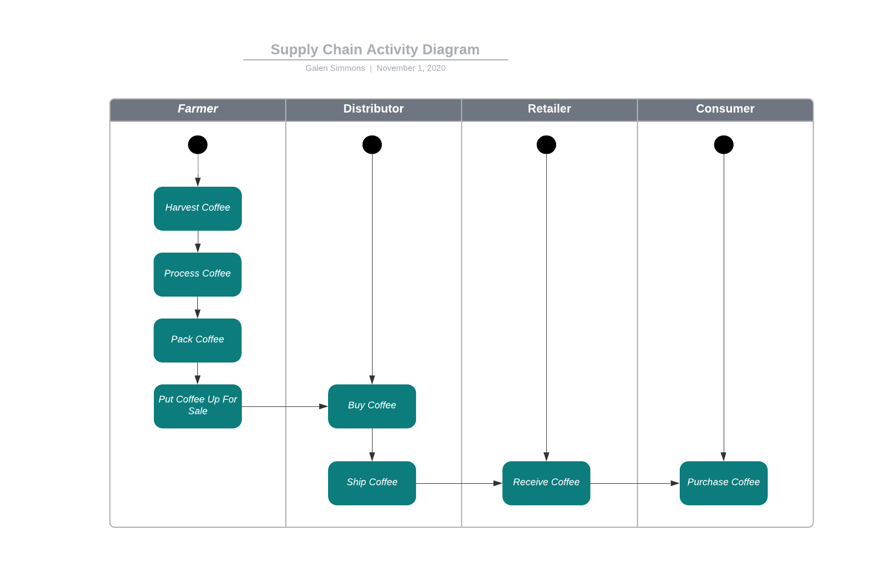
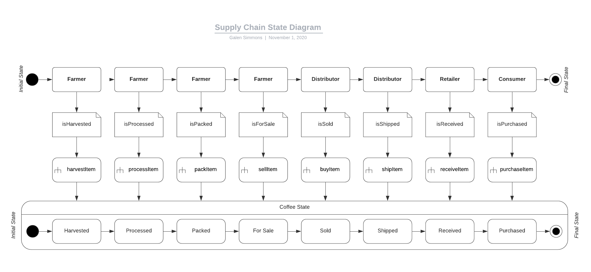
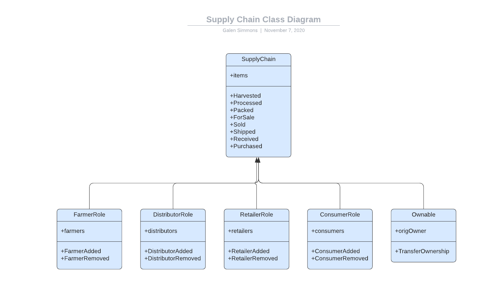

# Ethereum Dapp for Tracking Items through Supply Chain

## Submission Information
- [x] [UML Diagrams](#UML-Diagrams)
- [x] [Libraries Write-up](#Libraries-Write-up)
- [x] [IPFS Write-up](#IPFS-Write-up)
- [x] [General Write-up](#General-Write-up)

## Summary
The purpose of this project is to learn lower level components of establishing a sound web service architecture using Blockchain.  In this project, I created a dApp coffee supply chain solution on Ethereum using smart contracts with role-based permissions to track and verify a product's authenticity.  The code for this project is in the `coffee/` folder.

## Testing The dApp
Below is the output from my tests in the `test` folder.  To run the tests, simply execute `truffle test` at the command line.
```
Contract Owner: accounts[0]  0x27d8d15cbc94527cadf5ec14b69519ae23288b95
Farmer: accounts[1]  0x018c2dabef4904ecbd7118350a0c54dbeae3549a
Distributor: accounts[2]  0xce5144391b4ab80668965f2cc4f2cc102380ef0a
Retailer: accounts[3]  0x460c31107dd048e34971e57da2f99f659add4f02
Consumer: accounts[4]  0xd37b7b8c62be2fdde8daa9816483aebdbd356088


  Contract: SupplyChain
    ✓ Test that roles are correctly added to contract (184ms)
    ✓ Testing smart contract function harvestItem() that allows a farmer to harvest coffee (108ms)
    ✓ Testing smart contract function processItem() that allows a farmer to process coffee (58ms)
    ✓ Testing smart contract function packItem() that allows a farmer to pack coffee (58ms)
    ✓ Testing smart contract function sellItem() that allows a farmer to sell coffee (55ms)
    ✓ Testing smart contract function buyItem() that allows a distributor to buy coffee (67ms)
    ✓ Testing smart contract function shipItem() that allows a distributor to ship coffee (66ms)
    ✓ Testing smart contract function receiveItem() that allows a retailer to mark coffee received (65ms)
    ✓ Testing smart contract function purchaseItem() that allows a consumer to purchase coffee (52ms)
    ✓ Testing smart contract function fetchItemBufferOne() that allows anyone to fetch item details from blockchain
    ✓ Testing smart contract function fetchItemBufferTwo() that allows anyone to fetch item details from blockchain


  11 passing (821ms)
```

## Running the dApp
Screenshots etc

### UML Diagrams
As part of the project planning, I created UML activity, sequence, and state diagrams which are included below.

#### Activity Diagram


#### Sequence Diagram


#### State Diagram


#### Classes (Data Model)


### Libraries Write-up
Below are the dependencies in my `packages.json` file:
```json
"dependencies": {
    "solidity-docgen": "^0.5.7",
    "truffle": "^5.1.51",
    "truffle-assertions": "^0.9.2",
    "truffle-hdwallet-provider": "^1.0.17",
    "web3": "^1.3.0"
  }
```
**Why I used each library**:
- `solidity-docgen`: I tried out using solidity docgen to generate documentation for my smart contracts.  The generated documentation is in a `gitbook` contained in the `docgen` folder.  This library might be useful for future projects as smart contract libraries can get quite complex.
- `truffle`: truffle is a development framework for Ethereum that makes it easy to compile, test, and migrate solidity contracts to Ethereum networks.  For example, I used `truffle` to deploy my smart contracts to the `Rinkeby` test network.
- `truffle-assertions`: the assertions library for truffle has convenience functions designed for solidity assertions inside of truffle tests.  I used the assertion syntax to test whether my contracts correctly emitted different events as expected.
- `truffle-hdwallet-provider`: this libarary was used to enable my truffle deployments to spend test coins from my Metamask wallet on the Rinkeby network as part of deploying my contracts to `Rinkeby`
- `web3`:

### IPFS Write-up
I did not use IPFS for this project.

### General Write-up
I built the dApp in five parts:

- **Part 1 - Plan the project:** I made UML diagrams and described the libraries that I chose to use and why I chose to use them
- **Part 2 - Write smart contracts:** Based on the drafted specifications, I defined the required interfaces for the smart contracts and added the specific logic to each of the contracts: (i) `AccessControl` (ii) `Base` (iii) `Core`
- **Part 3 - Test smart contract code coverage:** I drafted tests to cover every function in the sequence diagram from `Part 1` and ensured that all tests were passing.
- **Part 4 - Deploy smart contracts on Rinkeby:** I used the Truffle framework and Infura to deploy my smart contracts onto the Rinkeby test network.
- **Part 5 - Build the frontend:** I created a frontend interface that allows users to interact with the smart contracts from the web.

The Rinkeby contract address for this project is: `0xa2033443417Dd94D7dc2BEffeaD213F270558D1E`

Smart contract documentation can be generated using `solidity-docgen`.