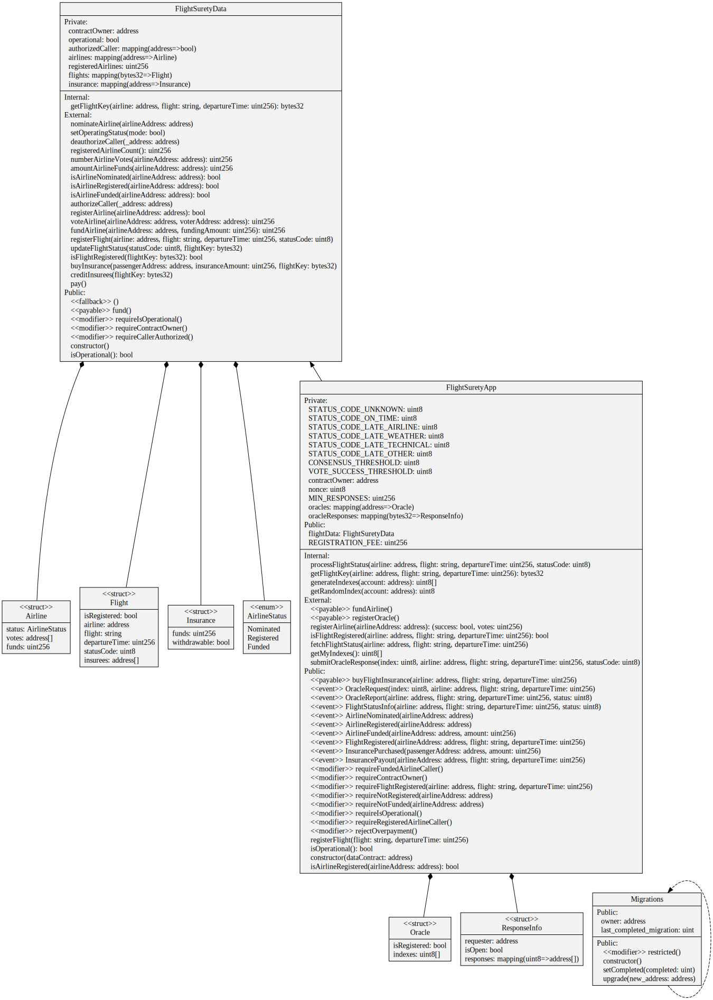
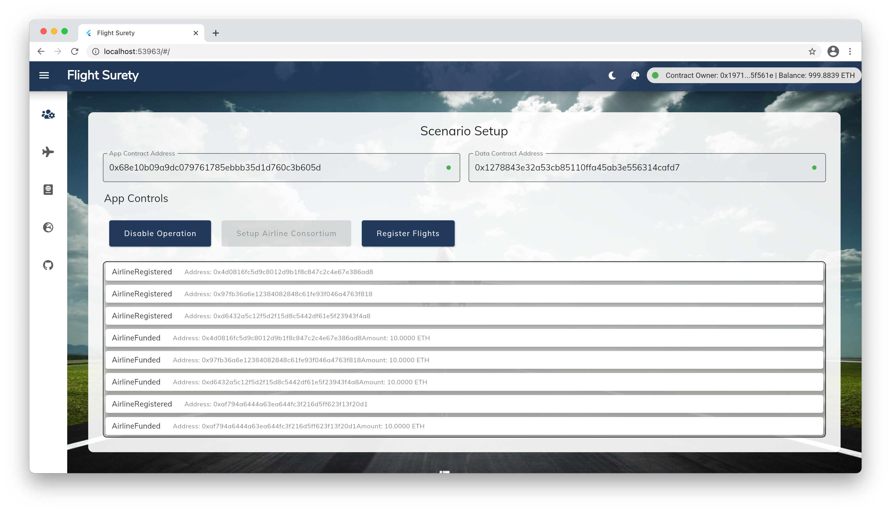
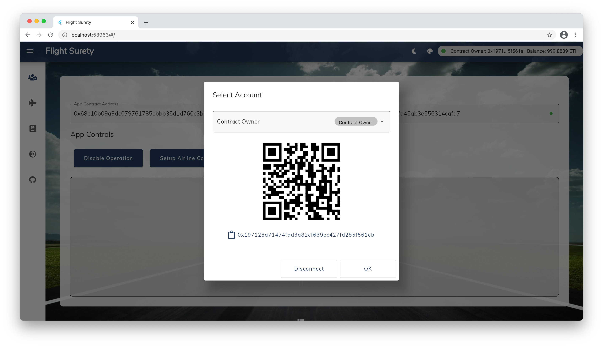
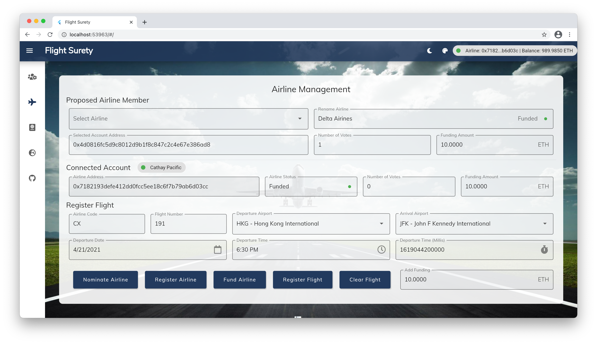
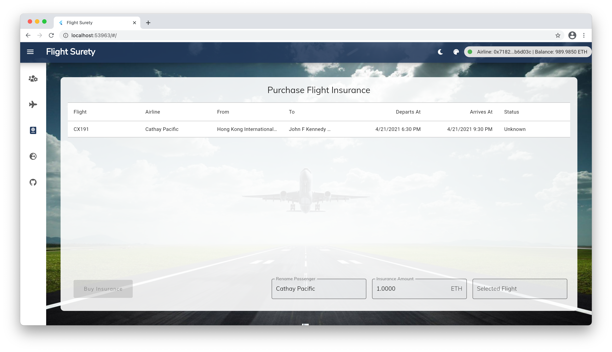
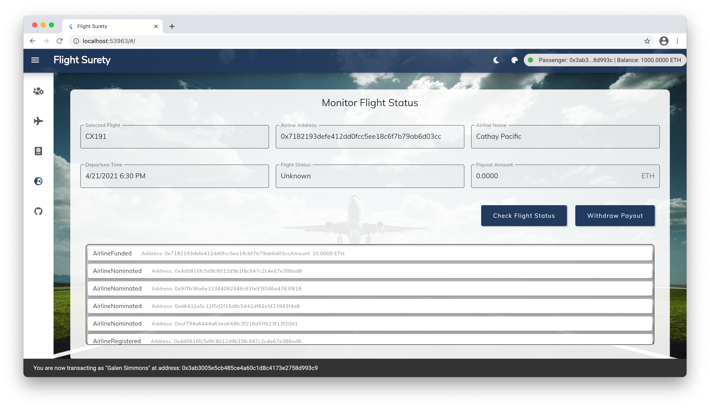

# FlightSurety


## Video
I made a video about this project linked here: https://vimeo.com/552011564

## Summary
The FlightSurety application is a dApp that enables airlines to form a consortium to register flights, receive flight status updates from mock oracles, and make payouts to passengers who have purchased flight insurance.  The dApp separates data storage concerns from application logic that make the app possible to upgrade without re-deploying the data contract.

## Project Specification 
I implemented the specifications listed below and demonstrated conformance with these specs in the `test/flightSurety.js` suite of tests.

- **Separation of Concerns**
    - Smart Contract code is separated into multiple contracts for data persistence, app logic, and oracle code
    - Dapp client has been created and is used for triggering contract calls. Client can be launched with "npm run dapp" and is available at http://localhost:8000
    - A server app has been created for simulating oracle behavior. Server can be launched with "npm run server"
    - Operational status control is implemented
    - Contract functions "fail fast" by having a majority of "require()" calls at the beginning of function body
- **Airlines**
    - First airline is registered when contract is deployed.
    - Only an existing airline may register a new airline until there are at least four airlines registered
    - Registration of fifth and subsequent airlines requires multi-party consensus of 50% of registered airlines
    - Airline can be registered, but does not participate in contract until it submits funding of 10 ether
- **Passengers**
    - Passengers can choose from a fixed list of flight numbers and departure that are defined in the Dapp client
    - Passengers may pay up to 1 ether for purchasing flight insurance.
    - If flight is delayed due to airline fault, passenger receives credit of 1.5X the amount they paid
    - Passenger can withdraw any funds owed to them as a result of receiving credit for insurance payout
    - Insurance payouts are not sent directly to passenger’s wallet
- **Oracles (Server App)**
    - Oracle functionality is implemented in the server app.
    - Upon startup, 20+ oracles are registered and their assigned indexes are persisted in memory
    - Update flight status requests from client Dapp result in OracleRequest event emitted by Smart Contract that is captured by server (displays on console and handled in code)
    - Server will loop through all registered oracles, identify those oracles for which the OracleRequest event applies, and respond by calling into FlightSuretyApp contract with random status code of Unknown (0), On Time (10) or Late Airline (20), Late Weather (30), Late Technical (40), or Late Other (50)

## Contracts
Below is a uml diagram showing the design of the `FlightSuretyApp` and `FlightSuretyData` contracts.  Although the contracts could be broken down into even more modular classes, I chose to have one data contract and one application contract for simplicity of exposition.  I used the `sol2uml` package to generate this diagram.



## Testing The dApp
Below is the output from my tests.  To run the tests, simply execute `truffle test` at the command line.
```
Contract: Flight Surety Tests
    Operations and Settings
      ✓ Has correct initial isOperational() value (48ms)
      ✓ Can block access to setOperatingStatus() for non-Contract Owner account (53ms)
      ✓ Can allow access to setOperatingStatus() for Contract Owner account
      ✓ Can block access to functions using requireIsOperational when operating status is false (65ms)
    Airline Business Logic
      ✓ First airline is registered when contract is deployed.
      Scenario: Only existing airline may register a new airline until there are at least four airlines registered
        ✓ Unregistered airline cannot register a new airline (129ms)
        ✓ Airline can be registered, but it cannot participate in contract until it submits funding of 10 ether (214ms)
        ✓ First airline registers the second airline. (87ms)
        ✓ Cannot re-register an airline that has already been registered (125ms)
        ✓ Second airline registers the third airline. (137ms)
        ✓ Third airline registers the fourth airline. (218ms)
      Scenario: Registration of fifth and subsequent airlines requires multi-party consensus of 50% of registered airlines
        ✓ Fourth airline cannot register the fifth without consensus. (277ms)
        ✓ Upon reaching 50% threshold of votes of all registered airlines, registration is successful (137ms)
    Passenger Business Logic
      ✓ Flights can be registered by the airline (147ms)
      ✓ Passengers can purchase flight insurance on a flight for up to 1 ether (49ms)
```

I used the `@openzeppelin/test-helpers` package for event assertions and reversion testing.  This package is actively maintained and includes elegant syntax for testing the existence of contract events in the transaction logs as demonstrated below:
```javascript
let fundingAmount = web3.utils.toWei('10', 'ether'); 
let tx0 = await app.fundAirline({ from: config.actors.airline2 , value: fundingAmount })

it("First airline registers the second airline.", async () => {
    let tx = await app.registerAirline(config.actors.airline2, { from: config.actors.airline1 });
    expectEvent(tx, 'AirlineRegistered', {
        airlineAddress: config.actors.airline2
    }); // throws assertion error if this event is not contained in the tx transaction logs
});
```
Testing reversions is demonstrated below:
```javascript
it("Cannot re-register an airline that has already been registered", async () => {
    await expectRevert(
        app.registerAirline(config.actors.airline2, { from: config.actors.airline1 }),
        "Airline is already registered"
    );
});
```

### Gas Estimation
I used the `eth-gas-reporter` npm package to estimate gas costs.  Given the high gas costs a user would incur by calling these contracts, there is definitely room to improve the implementation.  The  contains the measurements of gas consumption for the `flightSurety.js` tests.

## dApp Screenshots
I built the dApp frontend in flutter.  The app is located in the `src/flutter_dapp` folder.  The various screens contained in the dApp are shown and explained below:

### Scenario Setup
In the scenario setup screen, the contract owner can set up an airline consortium of five airlines and register flights for each airline


### Actor Selection
In the actor selection screen, the user of the dApp can switch between different dApp roles (i.e. Contract Owner, Airline, Passenger, Oracle or Unassigned).  In real life, you would not be able to do this, but this is a simulation, and the account switching functionality is not too different from what you might find in a wallet app like metamask.


### Airline Management
In the airline management screen, airlines can register other airlines, flights, and fund themselves with Ether, which covers the potential insurance payouts.


### Passenger Screen
In the passenger screen, a passenger can select a registered flight and purchase insurnace on it.


### Flight Status
In the flight status screen, a passenger can check the withdrawable payout that they may have received on a flight that is delayed for certain reasons.  The frontend of the app requests the flight status from Oracles, and there is a node js server in the background which operates the oracles that fulfill the request.  The node server can be found in the `src/server` folder.



