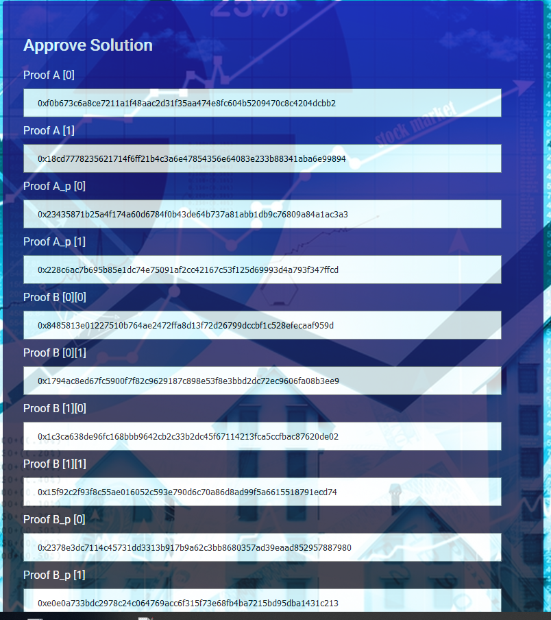
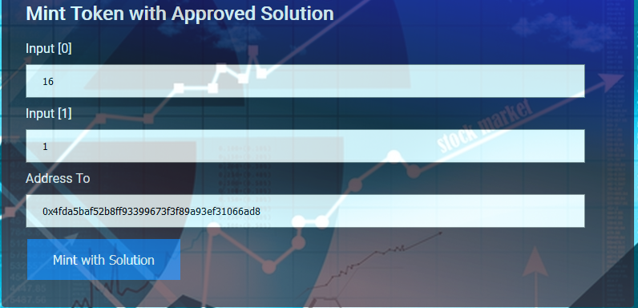
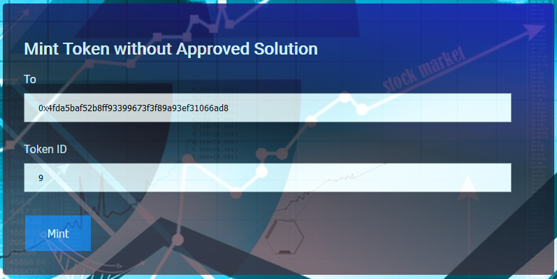
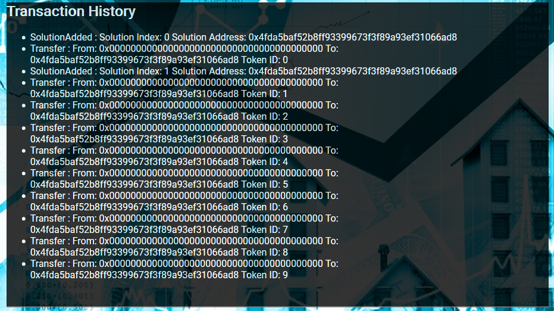
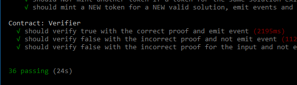

# Capstone: Real Estate Marketplace 

## Concept and explanation
Final Project for Blockchain NanoDegree that requires to mint own tokens to represent the title to the properties. Before minting the token, the owner needs to verify she/she owns the property. A zk-SNARKs (zoKrates) mechanism will be used to create a verification system which can prove the ownership of title to the property without revealing that specific information on the property.
Once the token has been verified it will be placed on a blockchain market place (OpenSea) for others to purchase.

Although is is optional, a UI has been provided in order to help viewing and minting tokens (with or without approved solution)
The optional front-end of the application runs on the client's machine, powered by a lite-server. Using web3/metamask , it communicates with the deployed smart contract from Rinkeby. 

## Contract addresses on rinkeby test network and ABI
#### 1. Verifier 
```
   > transaction hash:    0xebbbfe20ac43b0d13f1ff771a4b1b504a4267ae6e23c7f82b104a2c432a07366
   > Blocks: 0            Seconds: 9
   > contract address:    0x976148e0616bb79496EFc35B2721074304851FbF
   > block number:        4416748
   > block timestamp:     1558380765
   > account:             0x4FdA5baf52B8ff93399673F3f89A93ef31066AD8
```

#### 2. SolnSquareVerifier
```
   > transaction hash:    0x32be17f14f0119265795a113fd551839855f2682c36a865313b320a6817f9cd1
   > Blocks: 0            Seconds: 5
   > contract address:    0xcA11214d11F50FC700Ee18a68102bD5EdC9A84B6
   > block number:        4416749
   > block timestamp:     1558380780
   > account:             0x4FdA5baf52B8ff93399673F3f89A93ef31066AD8
```

### 3. Contract ABI
 Can be found on `eth-contracts/build/contracts` folder on github cloned repository
 
## OpenSea MarketPlace Storefront link
- Original minter : `https://rinkeby.opensea.io/accounts/0x4fda5baf52b8ff93399673f3f89a93ef31066ad8`
- Buyer : `https://rinkeby.opensea.io/accounts/0x15e542f44d1f0811ec4453fa5493eff1859f89b6`


## GUI Overview










## GUI Explanation

### 1. Token View
#### 1.1 Fields
- `Deployed SolnSquareVerifier Contract Owner` The address of the owner who deployed the contract. Can be acquired via using `Get Contract Owner` button
- `View token details` allows to input a token id and upon using `Get Token details` button, `Token Owner` & `Token URI` fields will be populated 
- `Token Owner` & `Token URI` displays the basic info about the token id
- `Token balance for address` Allows to input an address and upon selecting `Get token balance` will populate the field `Balance`
- `Balance` - gets populated with the number of tokens owner by `Token balance for address` after pressing `Get Token Balance`
#### 1.2 Buttons
- `Get Contract Owner` Reads and populates `Deployed SolnSquareVerifier Contract Owner` field with the address of the contract owner
- `Get Token Details` - Returns the basic token details for the token id of `View token details` field
- `Get Token Balance` Populates the `Balance` field with the number of tokens owned by `Token balance for address`

### 2. Approve Solution
#### 2.1 Fields
- `Proof A [0], Proof A [1], ..input` The values generated by Zokrates in the proof.json. Defaulted to the values generated when running 3 9 as solution. This token is already registered!
#### 2.2 Buttons
- `Approve Solution` Attempts to approve the inserted solution. MetaMask will reject the transaction if proof cannot be verified.
 
### 3. Mint token with approved solution
#### 3.1 Fields
- `Input [0]` & `Input [1]` Attempts to mint a token with a previous validated/approved solution. The two inputs are the inputs from proof.json
- `Address To` The address to who the token should be given to
#### 3.2 Buttons
- `Mint with solution` Attempts to mint a token using the Inputs[] and address. If the solution is already used OR unverified, an exception will be thrown. No Token Id is needed as it will use the previously approved solution's autogenerated index as tokenId.

### 4. Mint token without approved solution
#### 4.1 Fields
- `To` To who should the token be given to
- `Token ID` The Token ID. Will throw exception if token exists already
#### 4.2 Buttons
- `Mint` Attempts to mint the token. This procedure does not need an approved solution.

### 5. Transaction History
Listens and displays several important events emitted by the contract. 

## Getting Started
These instructions will get you a copy of the project up and running on your local machine for development and testing purposes. 

### Prerequisites (also for for generating the proof.json)

* [NodeJS](https://nodejs.org/en/download/current/) (The install will also include the npm node package manager)
* [ganache-cli](https://github.com/trufflesuite/ganache-cli) Fast Ethereum RPC client for testing and development
* [truffle](https://www.npmjs.com/package/truffle) Development environment, testing framework and asset pipeline for Ethereum
* MetaMask extension installed in your browser and few ethers on Rinkeby Test Network.
* [Docker](https://www.docker.com/) Enterprise Container Platform for High-Velocity Innovation
```
node -v
npm -v
npm i ganache-cli -g
npm i truffle -g
```

### Installing

A step by step series of examples that tell you have to get a development env running

Clone this repository:

```
git clone https://github.com/StefanelStan/Blockchain-Capstone-Real-Estate-Marketplace.git
```

Change directory to `P8` folder and install all requisite npm packages (as listed in `package.json`):

```
cd P8
npm install
```

## Running the tests
1. Start a local ganache-cli instance
```
ganache-cli
```
2. In a separate terminal window, Compile the contracts: This will create the smart contract artifacts in folder ```build\contracts```.
```
cd eth-contracts
truffle compile
```
3. Run the test command
```
cd eth-contracts
truffle.cmd test
```
All 36 tests should pass. 



## Launching the APP
1. Launch Ganache-cli: It is important to use a mnemonic for the ganache-cli and the given arguments. The same mnemonic will be used in Metamask to import the accounts
```
ganache-cli -m "word1 word2 word3 ....word12"
```

2. Compile & Deploy the contracts: In a separate terminal window deploy the contracts on ganache development network. Make sure you fill in your infuraKey and mnemonic into eth-contracts/config/
```
cd eth-contracts
truffle.cmd migrate --network development
```
3. In the same (or a new terminal) launch the dapp
```
cd P8
npm run dev
```

## Generating the proof from zokrates (on windows 10)
1. Navigate to project folder
` cd P8\zokrates\code\`

2. Run the zokrates docker image
`docker run -v $(pwd):/home/zokrates/code -ti zokrates/zokrates:0.3.0 /bin/bash`

3. Compile the program 
```
cd code
~/zokrates compile -i square/square.code
```

4. Generate the trusted setup
`~/zokrates setup`

5. Compute witness for your desired pair of number - square (the project already contains proof for [3,9] , [4-16] squares)
`~/zokrates compute-witness -a number square`

6. Generate proof
`~/zokrates generate-proof` At this point there should be a proof.json file that contains the ProofA[], ProofB[] fields that can be used to Approve Solution as described in the document UI

7. (Optional) Generate verifier.sol
`~/zokrates export-verifier	`

## Built With
```
Truffle v5.0.15 (core: 5.0.15)
Solidity - 0.5.2 (solc-js)
Node v10.15.3
Web3.js v1.0.0-beta.37
```
### Testing libraries
* [Chai](https://www.npmjs.com/package/chai)- BDD / TDD assertion library for node. It provides easy to read asserts and expects as well at matchers (greater, between, before, contains etc)
* [truffle-assertions](https://www.npmjs.com/package/truffle-assertions) - Additional assertions and utilities for testing Ethereum smart contracts in Truffle unit tests. Used to listen for events


### Development Libraries and Tools
* [Ethereum](https://www.ethereum.org/) - Ethereum is a decentralized platform that runs smart contracts. The SupplyChain contract is deployed on Rinkeby Test Network
* [Truffle Framework](http://truffleframework.com/) - Truffle is the most popular development framework for Ethereum with a mission to make your life a whole lot easier. Used for development and testing.
* [ganache-cli](https://www.npmjs.com/package/ganache-cli) Ganache CLI, part of the Truffle suite of Ethereum development tools, is the command line version of Ganache. Used to kickstart a a evm and personal blockchain to deploy and test the contract locally.
* [web3js](https://www.npmjs.com/package/web3) Ethereum JavaScript API.
* [truffle-hdwallet-provider](https://www.npmjs.com/package/truffle-hdwallet-provider) - HD Wallet-enabled Web3 provider. Use it to sign transactions for addresses. Used in truffle.cmd for deployment of contracts
* [Visual Studio Code](https://code.visualstudio.com/) - Web editor
* [lite-server](https://www.npmjs.com/search?q=lite-server) - Lightweight development node server for serving a web app. Used to kickstart the http server to deploy the html and js to interract with the dapp.
* [Open Zeppelin ](https://openzeppelin.org/)
* [Interactive zero knowledge 3-colorability demonstration](http://web.mit.edu/~ezyang/Public/graph/svg.html)
* [Docker](https://docs.docker.com/install/)
* [ZoKrates](https://github.com/Zokrates/ZoKrates)
